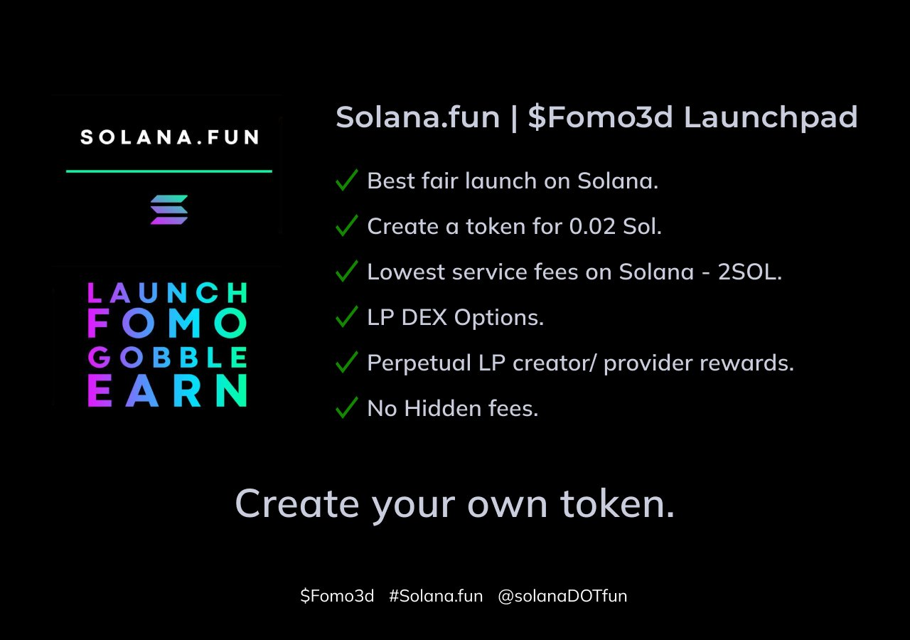

# Overview of FOMO3D Launchpad

FOMO3D's launchpad is designed to help new Solana-based memecoins gain initial traction. Here's what it offers:

- **Project Token Creation**: A streamlined no-code process for creators to create their memecoin projects onchain.
- **Pre-Bonding Launch**: A pre-bonding launch phase where supporters can buy the token at a discount.
- **Post-Bonding Launch**: A launch phase where the token is listed on FOMO3D and can be traded on the Gobbler AMM.

## Benefits

- **For Creators**: Access to a broad supporter base, project visibility, and structured token distribution.
- **For Supporters**: Early support opportunities in promising memecoins, with insights into project metrics and community support.