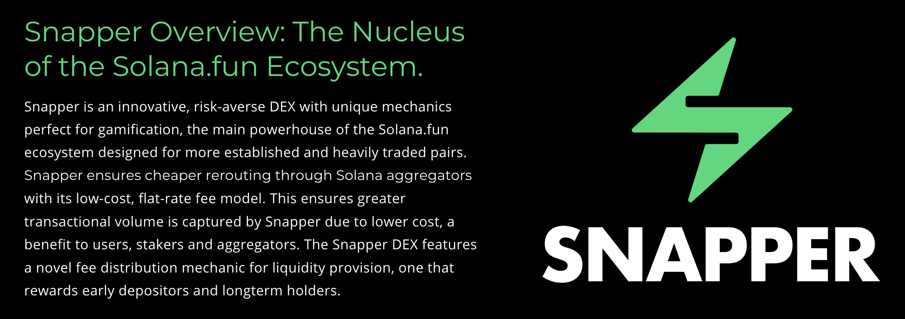

# Understanding the SOLFUN DEX

SOLFUN's Automated Market Maker (AMM) or DEX, introduces unique mechanics to enhance DeFi trading:

- **Dual Curve System**: Combines traditional constant product with a dynamic bonding curve for liquidity incentives.
- **Flat Fee Structure**: Aims at making large trades more cost-effective while reducing MEV impact.
- **Risk-Averse Design**: Innovative mechanics optimized for established and heavily traded pairs.
- **Aggregator-Friendly**: Lower costs enable efficient rerouting through Solana aggregators.
- **Novel Fee Distribution**: Unique reward system that benefits early depositors and long-term holders.

## Key Concepts

- **Liquidity Pools**: Users add tokens to pools to facilitate trading.
- **Swaps**: Exchange one token for another within the pools.
- **Liquidity Provider (LP) Tokens**: Earned by adding liquidity, these represent your share in the pool's fees and rewards.

Learn more about specific mechanics in the [Liquidity Provision](liquidity-provision.md) and [Trading](trading-on-solfun.md) sections.